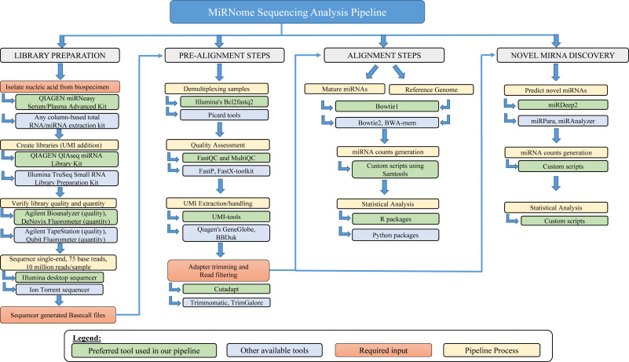

```{r setup, include=FALSE}
knitr::opts_chunk$set(include = FALSE, fig.path = "README_figs/")
library(gridGraphics)
library(grid)
library(gridExtra)
library(png)
library(jpeg)
```

## GitHub Documents

This pipeline for miRNA-Seq analysis was based on the paper [A bioinformatics approach to microRNA-sequencing analysis](https://www.sciencedirect.com/science/article/pii/S266591312030131X), as following.

## 



```{r pipeline figure}
figure <- png::readPNG("README_figs/README-pipeline.png")

grid.raster(figure)
```
