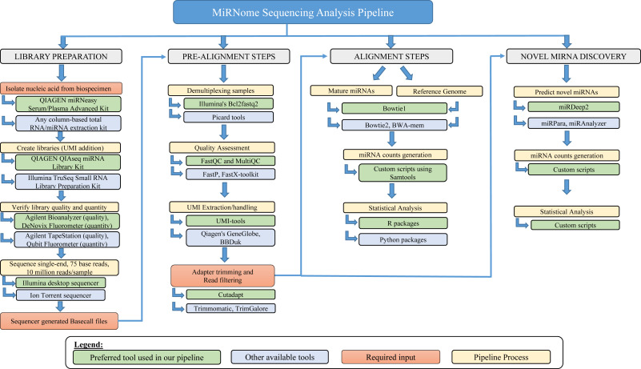

miRbaqcom
================

Download repository
``` bash
git clone https://github.com/hanielcedraz/miRbaqcom.git
```
Open miRbaqcom folder
``` bash
cd miRbaqcom
```
make pipelines executable
``` bash
chmod +x miRbaqcom*.R
```

Download the yaml file that contains the conda env: [baqcom.yaml](https://raw.githubusercontent.com/hanielcedraz/RNA-Seq_Course/main/curso_RNA-Seq.yaml](https://github.com/hanielcedraz/newBAQCOM/blob/main/baqcom_env.yaml))

Create baqcom env from yaml
``` bash
conda env create -f baqcom_env.yaml
```

## GitHub Documents

This pipeline for miRNA-Seq analysis was based on the paper [A
bioinformatics approach to microRNA-sequencing
analysis](https://www.sciencedirect.com/science/article/pii/S266591312030131X),
as following.

## 



## UMI Tools

### Instalation:

``` bash
$ pip install umi_tools
```

``` html
https://bmcbioinformatics.biomedcentral.com/articles/10.1186/s12859-017-1601-4

https://www.encodeproject.org/microrna/microrna-seq/

https://academic.oup.com/nargab/article/3/3/lqab068/6325159

https://docs.gdc.cancer.gov/Data/Bioinformatics_Pipelines/miRNA_Pipeline/

https://www.sciencedirect.com/science/article/pii/S266591312030131X#fig1

https://cutadapt.readthedocs.io/en/stable/installation.html

https://www.ncbi.nlm.nih.gov/labs/pmc/articles/PMC3245920/

https://github.com/OpenGene/fastp

https://cutadapt.readthedocs.io/en/stable/

https://rpubs.com/hanielcedraz/macs3pipeline

https://pip.pypa.io/en/stable/installation/

https://github.com/CGATOxford/UMI-tools

https://github.com/CGATOxford/UMI-tools/blob/master/doc/QUICK_START.md#step-4–mapping

https://github.com/salasouza/ecosystem

https://hub.docker.com/_/centos
```
